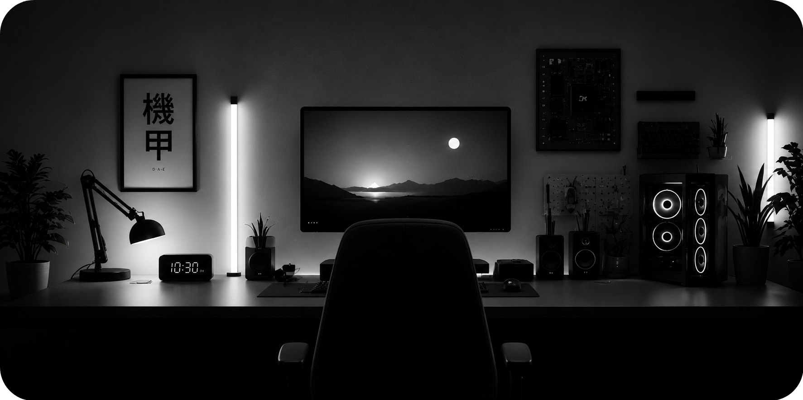
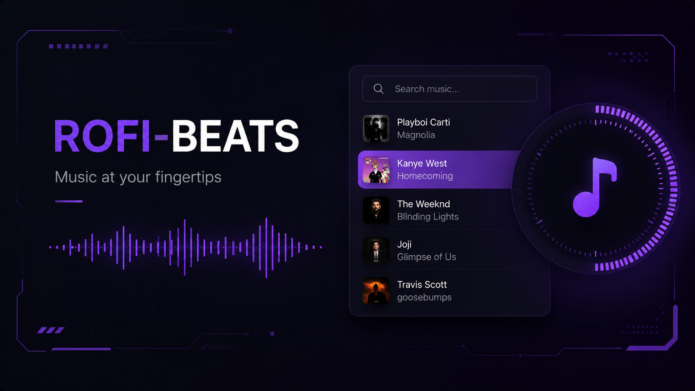

  

  IDEAL WORKSPACE

 

  

 

  

----------------------------------

  

<!-- PROJECTS HEADING -->

  <h1 style="font-size: 2.5rem; font-weight: 800; letter-spacing: 4px; margin-bottom: 10px; background: linear-gradient(90deg, #333, #666); -webkit-background-clip: text; -webkit-text-fill-color: transparent;">
    PROJECTS
  </h1>
  

  

  <table>
    <tr>
      <td valign="top" width="50%" style="padding: 8px;">
         
        <b>Youtube App</b> 
        A modern Youtube app built on electron with adblocking and other extra features.
        <a href="https://github.com/cx051/Youtube-App" style="background:#8a2be2;color:#fff;padding:5px 12px;border-radius:4px;text-decoration:none;font-weight:bold;font-size:11px">VISIT</a>
      </td>
      <td valign="top" width="50%" style="padding: 8px;">
         
        <b>Rofi Beats</b> 
        A minimal music interface focused on aesthetics, workflow, and lightweight performance.
          <a href="https://github.com/cx051/Rofi-Beats" style="background:#8a2be2;color:#fff;padding:5px 12px;border-radius:4px;text-decoration:none;font-weight:bold;font-size:11px">VISIT</a>
      </td>
    </tr>
  </table>

